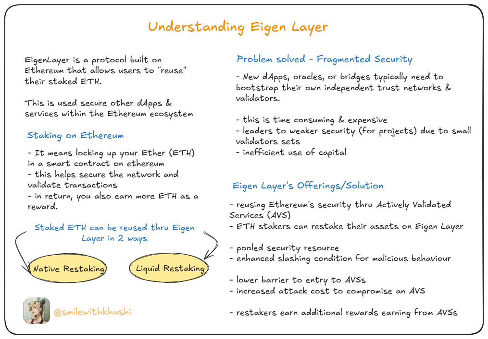

# EigenLayer - Restaking Protocol

## Introduction to EigenLayer

EigenLayer is a decentralized Ethereum restaking protocol. 
In simpler terms, it's a new layer built on top of Ethereum that allows ETH stakers to "reuse" their staked ETH or Liquid Staking Tokens (LSTs) to secure other decentralized applications (dApps) and services within the Ethereum ecosystem.

## Visual Overview




## What is Restaking?

Restaking is a novel mechanism that enables Ethereum validators to extend the security of their staked ETH to secure additional protocols built on top of Ethereum. By restaking, validators can:

- Earn additional yield from multiple protocols
- Contribute to the security of the broader Ethereum ecosystem
- Participate in validating multiple services without needing additional capital

## EigenLayer's Architecture


EigenLayer's architecture consists of several key components:

### Core Components

1. **EigenPods**: Smart contracts that allow native ETH stakers to opt into EigenLayer while maintaining their existing validator setup.

2. **AVSs (Actively Validated Services)**: Protocols and services that leverage EigenLayer's security through the restaked ETH.

3. **Operator Network**: The network of validators who opt into validating AVSs and earn rewards for their services.

4. **Slashing Mechanism**: A system that penalizes malicious behavior by reducing a validator's stake.

### Workflow

```
ETH Stakers → Restake in EigenLayer → Validate AVSs → Earn Rewards
```

### Security Model

EigenLayer creates a shared security layer where:

- Economic security scales with the amount of restaked ETH
- Slashing conditions provide strong disincentives for malicious behavior
- Multiple services can leverage the same security pool

## Benefits of EigenLayer

- **Enhanced Security**: Bootstraps new protocols with Ethereum's existing security
- **Capital Efficiency**: Reuses staked ETH instead of requiring new tokens
- **Ecosystem Growth**: Enables new types of services that were previously challenging to secure
- **Validator Incentives**: Creates additional revenue streams for ETH stakers


## Learn More

- [EigenLayer Official Website](https://www.eigenlayer.xyz/)
- [EigenLayer Documentation](https://docs.eigenlayer.xyz/)
- [EigenLayer GitHub](https://github.com/Layr-Labs/eigenlayer-contracts)