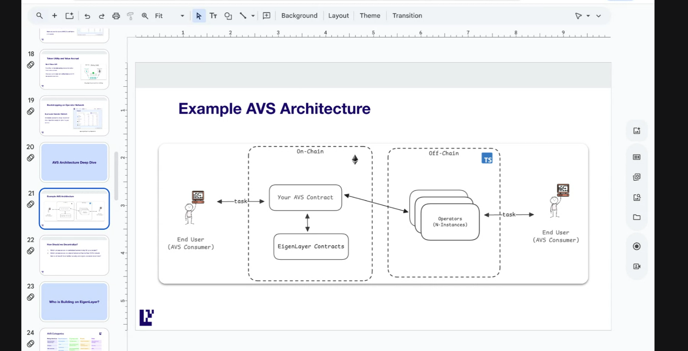
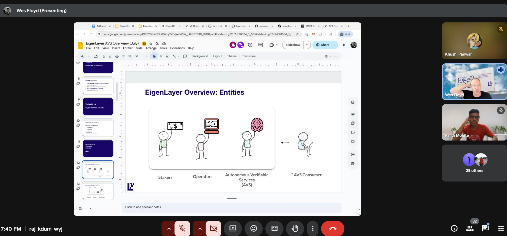
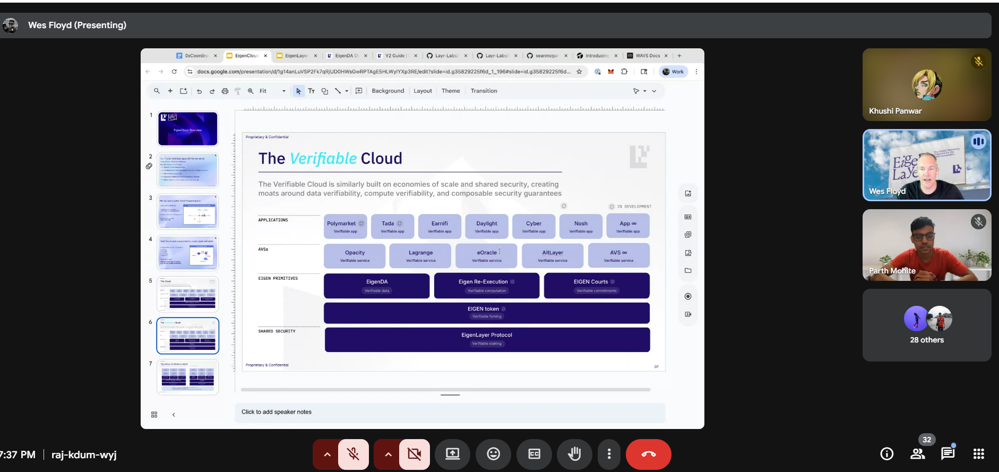
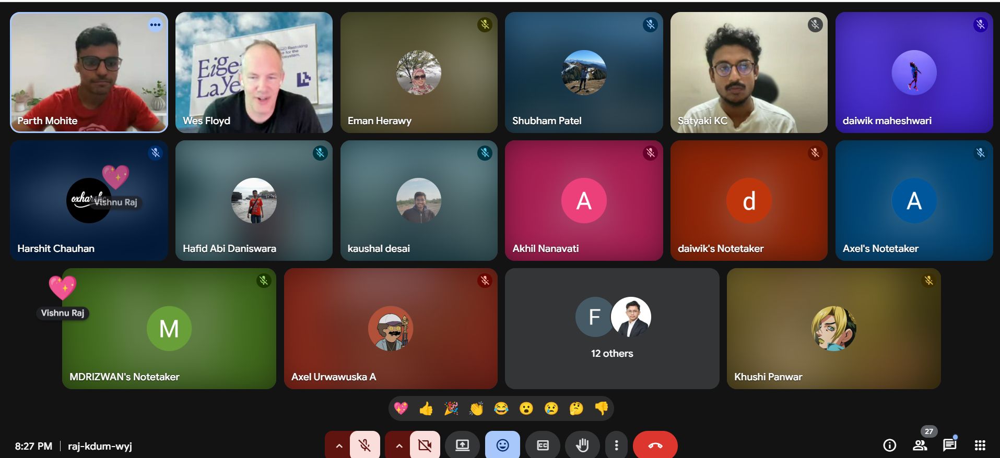
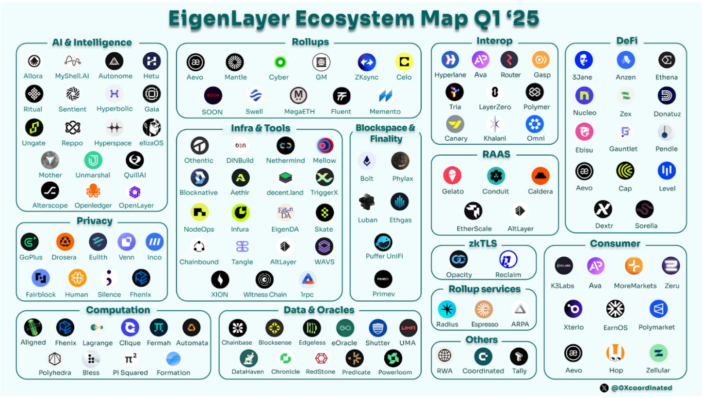
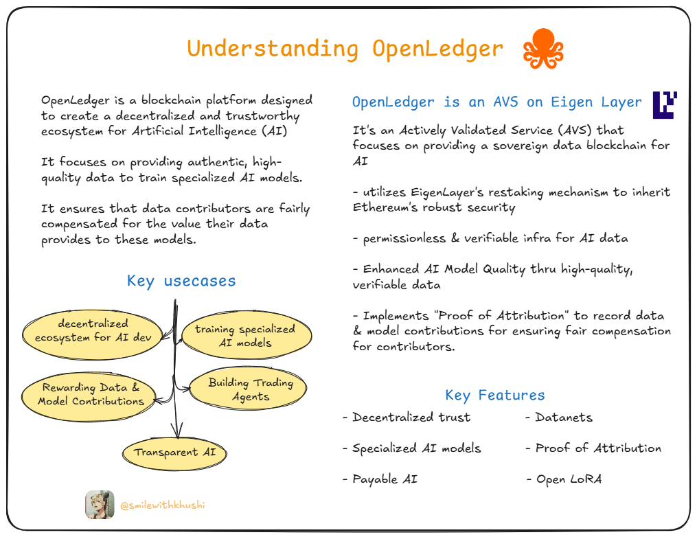

# Session 1: Introduction to Eigen Layer

This session was all about exploring Eigen ecosystem with Wes (Devrel @Eigen Layer), a groundbreaking Layer 2 solution built on Ethereum.

## What is Eigen Layer?

Eigen Layer is a restaking protocol that allows Ethereum validators to opt into additional validation responsibilities. It creates a decentralized security layer that enables new, innovative protocols to leverage Ethereum's existing security.

## Session Photos

Here are some key visuals from our session:
| Glimpse | Glimpse |
|---------------------|----------------------|
|  |  |
|  |  |

## Hands-on Tasks

| Task Name | Task Link |
|-----------|-----------|
| Research on Open Ledger(AVS from Eigen Ecosystem) | [Thread Link](https://x.com/SmileWithKhushi/status/1940029348922179645) |

## Highlights

| AVS Ecosystem | Understanding OpenLedger  |
|-----------|-----------|
|  |  |

## Resources

- [Eigen Layer Official Documentation](https://docs.eigenlayer.xyz/)
- [GitHub Repository](https://github.com/Layr-Labs/eigenlayer-contracts)
- [Eigen Layer Blog](https://www.eigenlayer.xyz/blog)